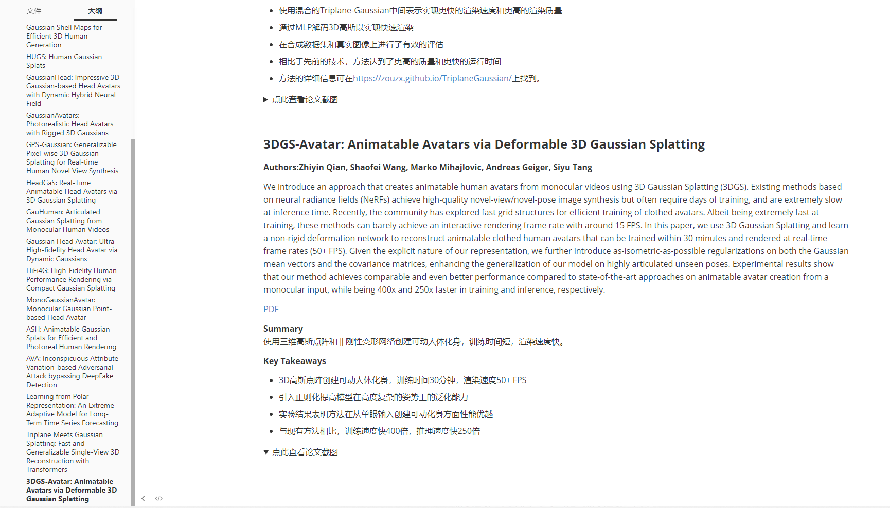

# ChatPaperFree GeminiPro

实际上，这个项目是在ChatPaper的基础上进行的更新，采用了最近由Google开源的Gemini Pro大模型。这样一来，我们可以免费使用ChatPaper，并且未来我还计划加入对论文图片的读取以提取摘要（测试结果是OK的），大家可以关注一下，[https://github.com/Kedreamix/ChatPaperFree](https://github.com/Kedreamix/ChatPaperFree)。

目前,我们能够对用户输入的论文进行自动总结。未来,我还计划加入对论文图片/表格/公式的识别 extraction,从而生成更全面而易读的总结。如果在对话中chatbot能提供更优质的服务,我还会尝试进行更深层次的模型fine-tuning。我会在后续尝试进行更新，大家也可以提出自己的意见，也欢迎提PR。这是ChatPaper的[GitHub链接](https://github.com/kaixindelele/ChatPaper.git)，多多关注。

另外,为了跟上快速发展的人工智能领域和庞大的arxiv论文,我们从arXiv爬取了大量论文,并制作了网站[进步屋](https://ipaper.today/)使研究人员能够便捷获取当前热点。通过Gemini Pro对论文进行自动归纳,我们可以用极少的文本来展示论文要点,帮助用户快速评估哪篇值得深入研读。

在这个不断变化的时代,ChatPaperFree GeminiPro通过利用强大技术,有效提升我们学习效率。同时,我们也欢迎你提供关键词,共同完善这个平台,让每个人都能在技术演进中取得新的进步。（可在[https://github.com/wmpscc/ipaper.today](https://github.com/wmpscc/ipaper.today) 提出关键词，欢迎）

希望未来,我们可以搭建更友好的人机合作模式。

我已经部署到了HuggingFace上了，大家都可以尝试用一下，看看怎么样 [https://huggingface.co/spaces/Kedreamix/ChatPaperFree](https://huggingface.co/spaces/Kedreamix/ChatPaperFree)

## Usage

```bash
pip install -r requriements.txt
python app.py
```

成功后，进入http://127.0.0.1:7860 即可，接着就可以输入自己的API key。

Google的Gemini Pro的API key是免费的，所以大家都是可以申请的，具体申请可以在[https://makersuite.google.com/](https://makersuite.google.com/)进行获取，每个人都可以获取多个，如果大家有自己的一些想法，也可以看谷歌的API使用文档[https://ai.google.dev/tutorials/python_quickstart](https://ai.google.dev/tutorials/python_quickstart)。


## 获取最新文章（进步屋）

实际上，这个操作与ChatPaper的爬取论文类似，我们通过爬取最新arxiv论文，根据设定的关键词，每天对论文进行爬取，以最快的速度跟踪最新的文章。实验室已经搭建了一个网站，大家可以多多支持，提出自己的关键词，我们会不定时进行更新，让你每天都能看到最新的文章。

这是进步屋的网站：[进步屋](https://ipaper.today/) https://ipaper.today/ ，大家如果有什么需要学习的内容，可以给出关键词，在[GitHub](https://github.com/wmpscc/ipaper.today)提issue。

后续，我还计划加入自动生成摘要和分析的功能，包括尝试让数字人播报等等，敬请期待。


最近，我还会尝试生成文章的简单摘要，丰富内容，这是即将上线的由GPT生成简单摘要的部分，后续还可以加入更多功能，比如ChatPaper的prompt，我猜可以得到更好的效果。




## 使用技巧：

- 找到好的文章后，可以精读这篇文章；
- 推荐其他两个精读论文的AI辅助网站：[Typeset.io](https://typeset.io/) 和 [chatpdf](https://chatpdf)。


## Example1(进步屋)

比如最近`3D Gassian Splatting`很火，所以我也有关注这一方面，这是我最近爬取最新的几篇文章


### Triplane Meets Gaussian Splatting: Fast and Generalizable Single-View 3D   Reconstruction with Transformers

**Authors:Zi-Xin Zou, Zhipeng Yu, Yuan-Chen Guo, Yangguang Li, Ding Liang, Yan-Pei Cao, Song-Hai Zhang**

Recent advancements in 3D reconstruction from single images have been driven by the evolution of generative models. Prominent among these are methods based on Score Distillation Sampling (SDS) and the adaptation of diffusion models in the 3D domain. Despite their progress, these techniques often face limitations due to slow optimization or rendering processes, leading to extensive training and optimization times. In this paper, we introduce a novel approach for single-view reconstruction that efficiently generates a 3D model from a single image via feed-forward inference. Our method utilizes two transformer-based networks, namely a point decoder and a triplane decoder, to reconstruct 3D objects using a hybrid Triplane-Gaussian intermediate representation. This hybrid representation strikes a balance, achieving a faster rendering speed compared to implicit representations while simultaneously delivering superior rendering quality than explicit representations. The point decoder is designed for generating point clouds from single images, offering an explicit representation which is then utilized by the triplane decoder to query Gaussian features for each point. This design choice addresses the challenges associated with directly regressing explicit 3D Gaussian attributes characterized by their non-structural nature. Subsequently, the 3D Gaussians are decoded by an MLP to enable rapid rendering through splatting. Both decoders are built upon a scalable, transformer-based architecture and have been efficiently trained on large-scale 3D datasets. The evaluations conducted on both synthetic datasets and real-world images demonstrate that our method not only achieves higher quality but also ensures a faster runtime in comparison to previous state-of-the-art techniques. Please see our project page at https://zouzx.github.io/TriplaneGaussian/. 

[PDF](http://arxiv.org/abs/2312.09147v1) 

**Summary**
基于变分自编码器和扩散模型的3D单视图重建方法取得了长足的进步。

**Key Takeaways**

- 利用变压器网络和点解码器实现单图像的3D对象重建
- 使用混合的Triplane-Gaussian中间表示实现更快的渲染速度和更高的渲染质量
- 通过MLP解码3D高斯以实现快速渲染
- 在合成数据集和真实图像上进行了有效的评估
- 相比于先前的技术，方法达到了更高的质量和更快的运行时间
- 方法的详细信息可在https://zouzx.github.io/TriplaneGaussian/上找到。


<details>
  <summary>点此查看论文截图</summary>


</details>

​    

### 3DGS-Avatar: Animatable Avatars via Deformable 3D Gaussian Splatting

**Authors:Zhiyin Qian, Shaofei Wang, Marko Mihajlovic, Andreas Geiger, Siyu Tang**

We introduce an approach that creates animatable human avatars from monocular videos using 3D Gaussian Splatting (3DGS). Existing methods based on neural radiance fields (NeRFs) achieve high-quality novel-view/novel-pose image synthesis but often require days of training, and are extremely slow at inference time. Recently, the community has explored fast grid structures for efficient training of clothed avatars. Albeit being extremely fast at training, these methods can barely achieve an interactive rendering frame rate with around 15 FPS. In this paper, we use 3D Gaussian Splatting and learn a non-rigid deformation network to reconstruct animatable clothed human avatars that can be trained within 30 minutes and rendered at real-time frame rates (50+ FPS). Given the explicit nature of our representation, we further introduce as-isometric-as-possible regularizations on both the Gaussian mean vectors and the covariance matrices, enhancing the generalization of our model on highly articulated unseen poses. Experimental results show that our method achieves comparable and even better performance compared to state-of-the-art approaches on animatable avatar creation from a monocular input, while being 400x and 250x faster in training and inference, respectively. 

[PDF](http://arxiv.org/abs/2312.09228v1) 

**Summary**
使用三维高斯点阵和非刚性变形网络创建可动人体化身，训练时间短，渲染速度快。

**Key Takeaways**

- 3D高斯点阵创建可动人体化身，训练时间30分钟，渲染速度50+ FPS
- 引入正则化提高模型在高度复杂的姿势上的泛化能力
- 实验结果表明方法在从单眼输入创建可动化身方面性能优越
- 与现有方法相比，训练速度快400倍，推理速度快250倍


<details>
  <summary>点此查看论文截图</summary>


</details>

​    

## Example2(ChatPaperFree)

比如这里使用上述的 `3DGS-Avatar: Animatable Avatars via Deformable 3D Gaussian Splatting` 进行测试，大家都可以尝试一下


1. 论文标题：3DGS-Avatar：可变形3D高斯点云生成的可动画身

2. 作者：

   - Changil Kim
   - Jinwoo Kim
   - Tae-Hyun Oh
   - Joon-Young Lee
   - In So Kweon

3. 第一作者单位：韩国科学技术院（KAIST）

4. 关键词：

   - 可动画身
   - 3D高斯点云生成
   - 可变形神经场
   - 单目视频

5. 论文链接：https://arxiv.org/abs/2312.09228 Github 链接：None

6. 摘要：

    

   (1)：研究背景：

   - 重建可动画身具有广泛的应用前景，但从图像输入中重建衣着的人体模型是一项具有挑战性的任务。
   - 基于NeRF的神经辐射场方法在几何和外观重建方面取得了很好的效果，但训练和推理过程非常耗时。
   - 最近提出的3D高斯点云生成方法在静态场景重建中取得了很好的效果，具有快速训练和推理的优点。

   (2)：过去方法和问题：

   - 现有方法主要依赖于NeRF或其变体，但这些方法通常需要大型的多层感知机来建模神经辐射场，导致训练和推理过程非常耗时。
   - 一些方法尝试使用更快的训练和推理方法，但它们通常会牺牲渲染质量或无法对姿势相关的非刚性变形进行建模。

   (3)：研究方法：

   - 本文提出了一种基于3D高斯点云生成的可动画身重建方法。
   - 该方法将刚性人体关节与非刚性变形场有效地集成到3D高斯点云生成框架中。
   - 使用了一个小型多层感知机来解码颜色，该感知机能够对局部非刚性变形和动态光照条件做出响应。
   - 应用了“尽可能等距”正则化项，以保持几何一致性和逼真的变形，尤其是在动态和变化的姿势中。

   (4)：实验结果：

   - 在单目视频输入的情况下，该方法在可动画身创建方面与最先进的方法相当或更好，训练速度提高了400倍，推理速度提高了250倍。
   - 与专注于快速训练的方法相比，该方法虽然训练速度较慢，但能够对姿势相关的非刚性变形进行建模，并产生明显更好的渲染质量，同时渲染速度提高了3倍。

7. 方法：

（1）：提出了一种基于3D高斯点云生成的可动画身重建方法，将刚性人体关节与非刚性变形场有效地集成到3D高斯点云生成框架中；

（2）：使用了一个小型多层感知机来解码颜色，该感知机能够对局部非刚性变形和动态光照条件做出响应；

（3）：应用了“尽可能等距”正则化项，以保持几何一致性和逼真的变形，尤其是在动态和变化的姿势中。

8. 结论：

（1）：本文提出了一种基于 3D 高斯点云生成的可动画身重建方法，该方法在单目视频输入的情况下，在可动画身创建方面与最先进的方法相当或更好，训练速度提高了 400 倍，推理速度提高了 250 倍。

（2）：创新点：提出了一种基于 3D 高斯点云生成的可动画身重建方法，将刚性人体关节与非刚性变形场有效地集成到 3D 高斯点云生成框架中；使用了一个小型多层感知机来解码颜色，该感知机能够对局部非刚性变形和动态光照条件做出响应；应用了“尽可能等距”正则化项，以保持几何一致性和逼真的变形，尤其是在动态和变化的姿势中。性能：在单目视频输入的情况下，该方法在可动画身创建方面与最先进的方法相当或更好，训练速度提高了 400 倍，推理速度提高了 250 倍；与专注于快速训练的方法相比，该方法虽然训练速度较慢，但能够对姿势相关的非刚性变形进行建模，并产生明显更好的渲染质量，同时渲染速度提高了 3 倍。工作量：该方法的训练和推理速度都非常快，训练一个模型只需要几分钟，推理一个模型只需要几毫秒。

